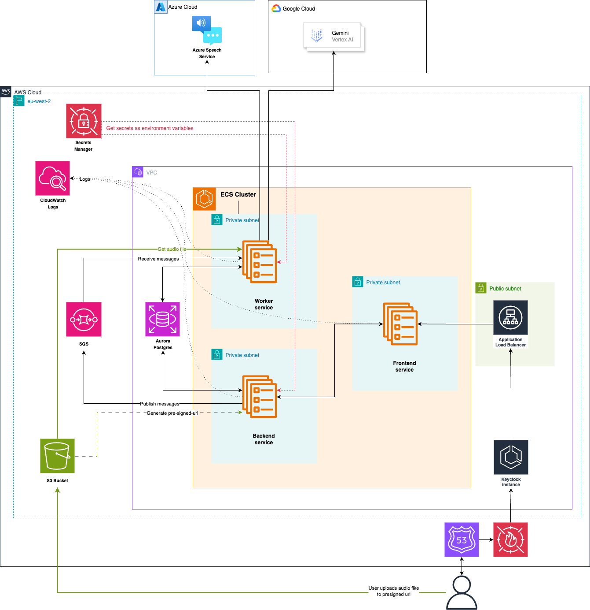
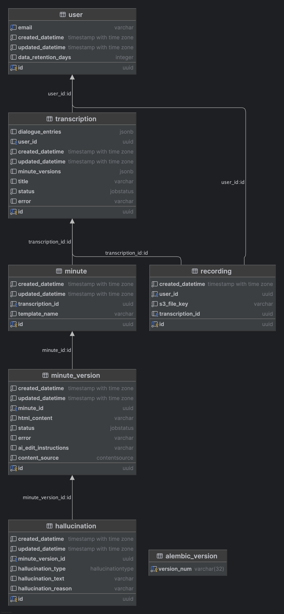

[](https://github.com/i-dot-ai/minute/actions/workflows/build.yml?query=branch%3Amain)

# Minute

> [!IMPORTANT]
> Incubation Project: This project is in active development and a work in progress.

Minute is an application that is designed to simplify the transcription and minuting of meetings in the public sector. Built with modern web technologies and AI-powered transcription and summarisation services, Minute transforms how government organisations handle meeting documentation by automating the conversion of audio recordings into structured, professional minutes.

## Key Features

**AI-Powered Transcription**: Minute integrates with multiple transcription services including Azure Speech-to-Text and AWS Transcribe, automatically selecting the most appropriate service based on audio duration and quality. The system handles various audio formats and automatically converts them to optimize transcription accuracy.

**Professional Meeting Templates**: The application includes specialized templates tailored for different types of government meetings, including Cabinet meetings, planning committees, care assessments, and general-purpose meetings. Each template follows specific formatting standards and style guides required for official documentation.

**Intelligent Minute Generation**: Beyond simple transcription, Minute uses AI to structure conversations into professional minute formats, applying proper grammar, tense conversion, and formatting rules specific to government documentation standards.

**Multi-Format Audio Support**: Upload recordings in various formats - the system automatically handles conversion and optimization for the best transcription results. Support for mono and multi-channel audio ensures compatibility with different recording setups.

**Data Retention**: Configurable data retention policies ensure compliance with government data handling requirements, with special provisions for different departments' retention policies.

**Real-Time Processing**: Asynchronous processing architecture ensures efficient handling of large audio files, with job status tracking and progress monitoring throughout the transcription and minute generation process.

Minute streamlines the traditionally time-intensive process of creating meeting minutes, allowing public sector organizations to focus on decision-making rather than documentation overhead.

## Development

#### Run the app locally

1. copy `.env.example` to a file called `.env`, and fill in the required values
2. Run `docker compose up --build`

This will build and run 5 containers:

1. Frontend app hosted at http://localhost:3000
2. Backend api available at http://localhost:8080
3. Worker service, which process transcriptions and does not have a public facing url
4. Postgres database hosted at http:localhost:5432
5. Localstack to simulate AWS SQS

#### Set up your development environment:

We use dev containers to emulate the cloud environment in which Minute is usually deployed.

` docker compose up --watch`

...will sync local file changes to the docker containers and restart them as appropriate. Note that `docker compose down` will revert the containers to their base state. See [this issue](https://github.com/docker/compose/issues/11102)

## Project structure

#### `frontend/`

The frontend uses Next.js. Calls to the API are made from the client-side and proxied api using Next's middleware. All API calling code is auto-generated by [Hey API](https://heyapi.dev/), the config for this can be found in `frontend/openapi-ts.config.ts`. It uses the api running locally to get the openapi.json, so to regenerate the types run the docker compose, and then run `npm run openapi-ts` in `frontend/`.

#### `backend/`

The backend uses FastAPI and is responsible for making initial database writes and sending long running processes to a queue (typically SQS)

#### `worker/`

The worker reads from the queue and executes transcription/file conversion/llm calls, and updates the database with the results

## Deployment

#### Architecture diagram

Minute was developed to run on AWS and/or Azure, with abstractions available for message queues and cloud storage.



#### Database Schema



#### Sentry setup (optional)

To set up sentry for telemetry, create an account at [sentry.io](sentry.io).

- Navigate to the `projects` page
- Click `Create project`
- Select `FASTAPI` as project type
- Click create
- On the following page, in the `Configure SDK`, copy the value for `dsn=` **KEEP THIS SECRET**
- Navigate to the SSM parameter store entry for your deployed application
- Replace `SENTRY_DSN` value with the value you copied

#### Posthog setup (optional)

To set up posthog for UX tracking, feature flags etc, create an account at [eu.posthog.com](https://eu.posthog.com/).

- create a project and obtain an API key (it should start `phc_`)
- set the key `POSTHOG_API_KEY` value in your `.env`

## Testing

To run unit tests:

```bash
make test
```

### Testing paid APIs and LLM prompt evaluations

A special set of tests are available to evaluate paid calls to LLM providers. Since we don't want to run this all the
time, we enable these with:

```bash
ALLOW_TESTS_TO_ACCESS_PAID_APIS=1
```

is in your `.env` file.

In order to run some tests, you will need some preprocessed transcript `.json` files. These should be located in
the top level `.data` dir in the repo. Within this directory, different subdirectories are routed to
different tests (see [test_queues_e2e.py](tests/test_queues_e2e.py) for an example).

## Adding custom templates

You can add your own templates by implementing either the `SimpleTemplate` or `SectionTemplate` protocols (see [here](backend/templates/types.py))
Simply put them in the [templates](backend/templates) directory, and they will automatically be discovered when the backend starts.
