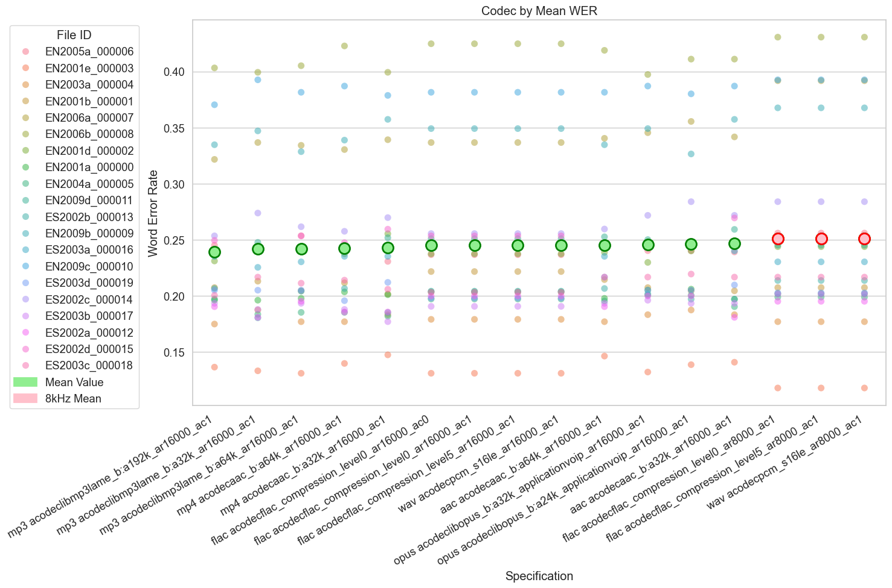
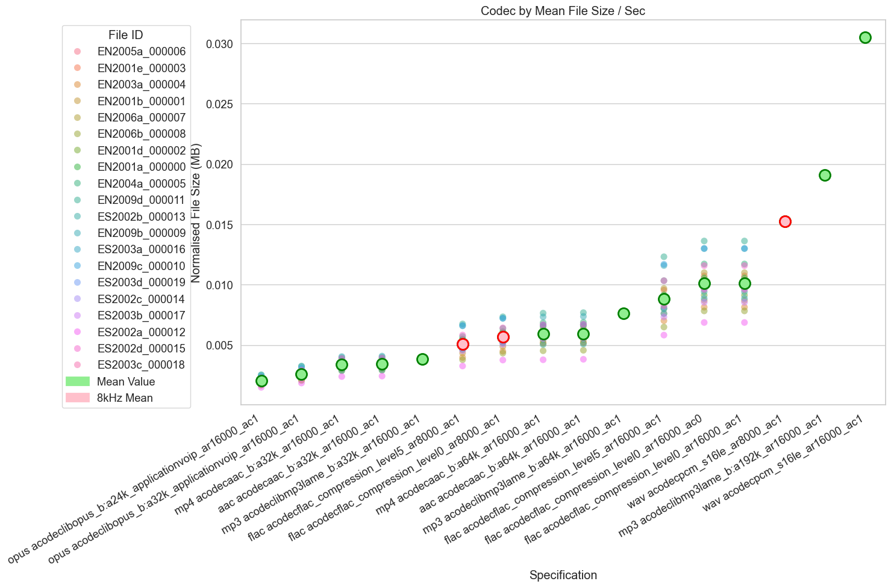
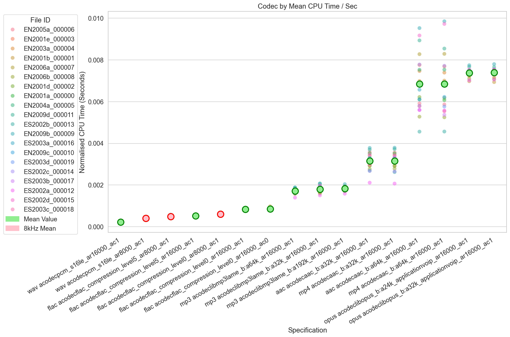
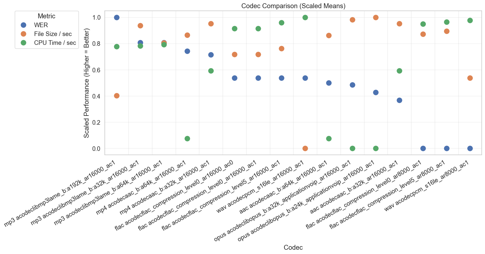
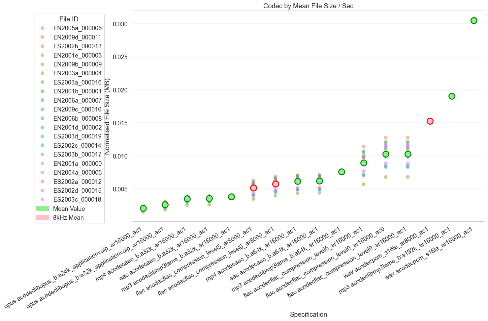
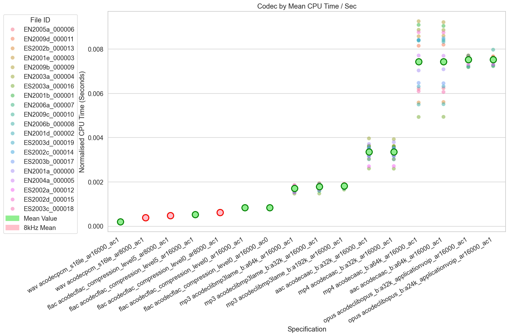
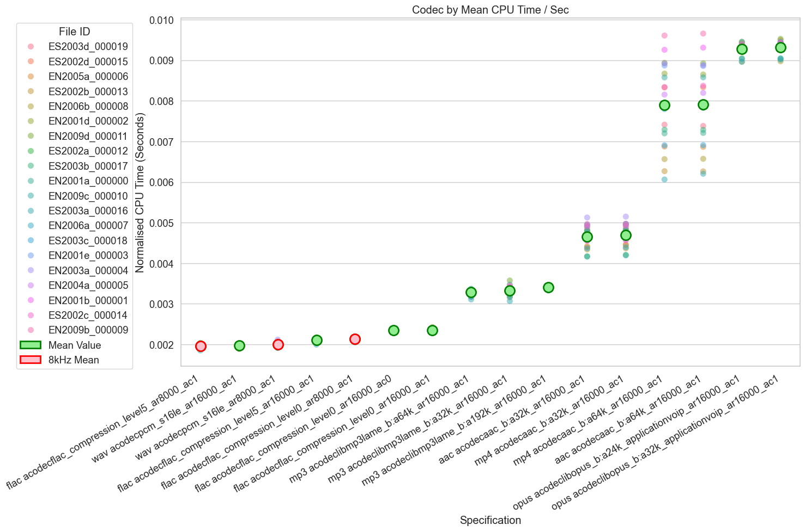

# Optimise FFmpeg File Processing

[Ticket 258](https://mhclgdigital.atlassian.net/browse/AIILG-183)

Optimise FFmpeg processing by exploring various codecs/flags to find one that minimises CPU time, file size, and transcritpion error.

## Considered Options

1. WAV: Lossless
2. FLAC: Lossless, smaller file size than WAV
3. MP3: Currently used in Minute, lossy
4. AAC: Lossy, successor to MP3
5. Opus: Lossy, more modern compared to MP3 and AAC
6. MP4: AAC inside MP4 container

## Method

- Using 20 samples from the AMI dataset, cropped to be 1-10 minutes each (averaging 4 minutes).
- Convert files into various file types, optimising for:
  - Transcription quality (Word Error Rate)
  - File size (MB per second of audio)
  - CPU time (FFmpeg measurements of `utime` + `stime` per second of audio)

## Outputs

### WER

Most variants are within a 1% mean WER of each other. The best score was 0.240 and the worst score was 0.251 (difference of 1.1%). Excluding variants with smaple rates of 8k (highlighted in red) the worst score was 0.247 (difference of 0.7%).

This suggests we should at least use sample rate of 16k (aligning with [Azure’s recommendation](https://learn.microsoft.com/en-us/azure/ai-services/speech-service/concepts/audio-concepts#sample-rate)).

### File Size and CPU Time

Given that all codecs at a 16k sample rate show very close WER scores, we should look to optimise file size and CPU time among those options:

- MB / sec : Min = 0.002041, Max = 0.030518, Difference = ~175%
- CPU time / sec : Min = 0.000226, Max = 0.007379, Difference = ~190%

Opus, MP4 and AAC have the smallest file sizes, but the highest CPU times. WAV has the largest file size but the shortest CPU time.

Of the 2 remaining options, MP3 and FLAC, MP3 has smaller file sizes but increased CPU time (and slightly lower WER). Would we prefer to optimise for file size or CPU time?

### Proposed Decision Outcome

All three metrics scaled and plotted on the same axis:

Currently, no matter which option is preferred, Minute’s existing implementation of MP3 at a 192k bitrate seems excessive. A much reduced bitrate of 32k has an almost identical WER score, but with much smaller file sizes (and the same CPU time).

Suggested parameters:

- Sample rate 16000 ([Azure recommendation](https://learn.microsoft.com/en-us/azure/ai-services/speech-service/concepts/audio-concepts#sample-rate)) (`-ar:16000`)
- Mono audio ([Azure reccomendation](https://learn.microsoft.com/en-us/azure/ai-services/speech-service/concepts/audio-concepts#channels)) (`-ac:1`)

If balancing file size and CPU time:

- MP3: with a lower bitrate than Minute currently uses (32k/64k vs 192k)
- FLAC: with some level of compression

If file size doesn't matter:

- WAV: shortest CPU time
- FLAC: almost as short a CPU time with ~1/3 of the file size

## Caveats/Questions

- Some lossless formats perform worse than lossy formats (e.g. WAV vs MP3). This is unintuitive.
  - An explanation for this could be due to the fact that lots of training data is compressed, and due to the fact that [compression can reduce noise](https://link.springer.com/chapter/10.1007/978-3-030-60276-5_3).
- Somewhat high mean WER scores across all codecs.
- Using only WER for transcription quality - no metrics on semantic quality or diarisation.
- Sample is quite small - Minute meetings could be closer to 1 hour (vs ~5 minutes).
  - Avoided longer samples/more codec combinations as this increases transcription time.
  - Looking at non-transcription metrics however, using longer files (~1 hour) shows very little change in CPU time per second and file size per second (linear scaling):
    
    
- Does changing the original file type impact CPU time?
  - Converting from Opus instead of WAV - overall trends stay the same:
    
