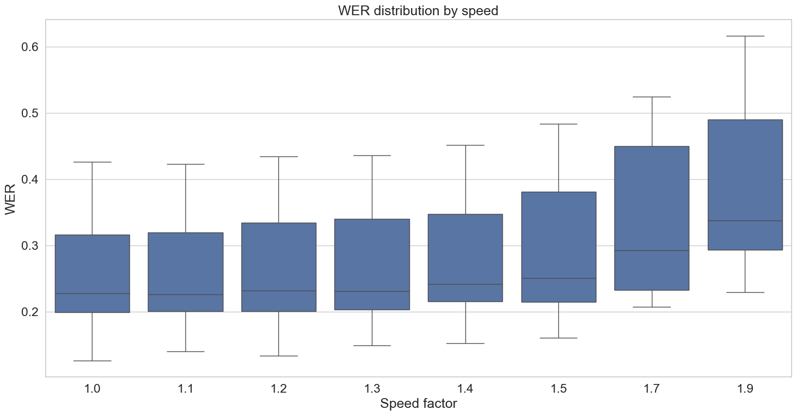
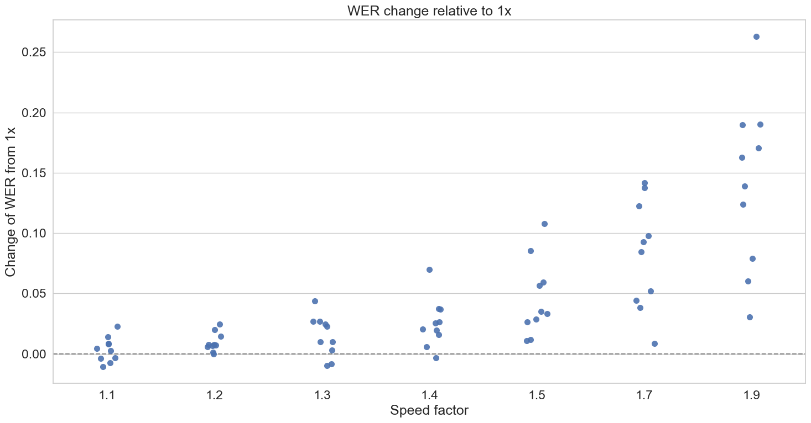
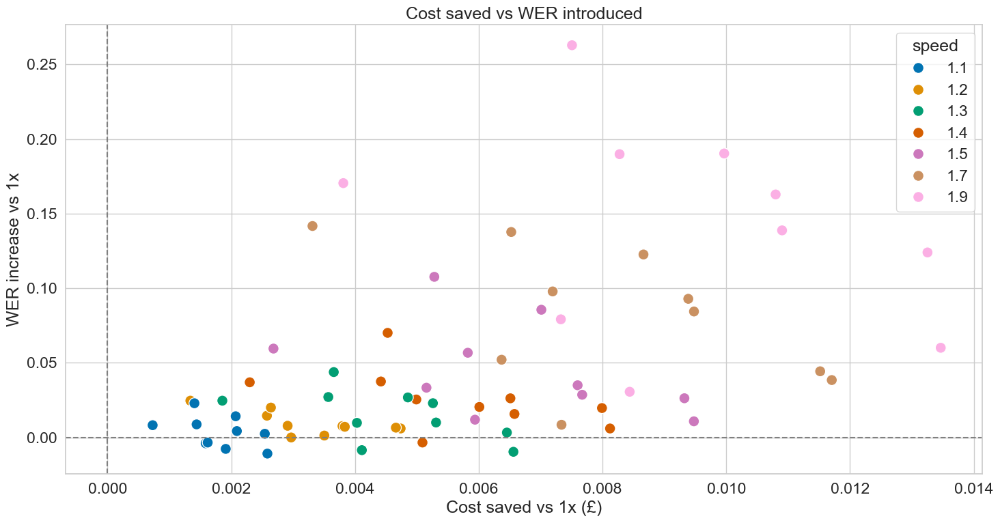
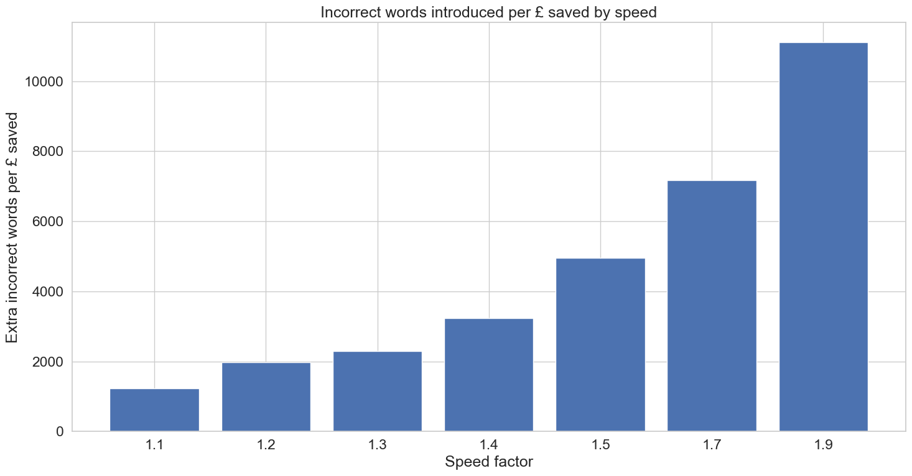
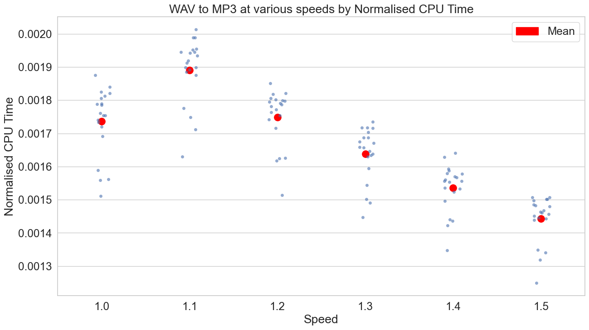
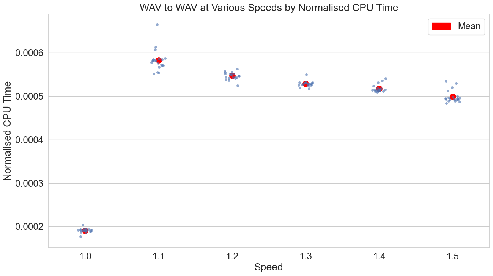

# Explore Speeding Audio

[Ticket 180](https://mhclgdigital.atlassian.net/browse/AIILG-180)

Explore how transcribing a sped up audio file impacts transcription quality (WER) and transcription cost.

## Considered Options

Speeding up audio from 1.0x speed to rates 1.1x, 1.2x, 1.3x, 1.4x, 1.5x, 1.7x, and 1.9x.

## Method

- Using 10 samples from the AMI dataset, 1-10 minutes each.
- Speed audio files using FFmpeg, optimising for:
  - Transcription quality (Word Error Rate)
  - Transcription cost (using Azure pricing)
- Compare these metrics against 1.0x speed.

## Outputs

WER increases linearly with sped audio:

Relative to 1.0x:

This does come at the benefit of cost savings, with higher speeds resulting in higher cost saved:

### (Proposed) Decision Outcome

How do we want to balance cost savings vs WER. One way we could look at it is how much error is introduced by increasing audio speed:

If we want no more error, we should stay at 1.0x speed. However, cost savings are avaialable at the expense of transcription quality.

Our appetite for this trade-off is dependant on overall end-to-end transcription quality. Once we have this information, a decsion can be made - if we speed up audio, and if so to what speed.

This decision will also need to anticipate some implementation work. The audio is fed back to the user on the frontend and we may want to avoid playing the audio at a faster than 1.0x speed.

## Caveats/Questions

- Some instances of sped audio reduce WER, unintuitive outcome.
- Only WER used for transcription quality - no metrics on diarisation or semantic quality.
  - WER score doesn't replace human assessment of transcription quality
- What speed do MoJ use (if used)?
- Does speeding up audio introduce CPU processing time?:
  - Yes, there is a small increase in CPU time. This can be seen in the following example, converting from WAV to MP3 at various speeds, where 1.0x speed has no speed filter applied. The initial increase is decreasing the faster the audio is sped up - this is due to the fact that there is less audio that needs to be processed.
    
    Another WAV to WAV example:
    
