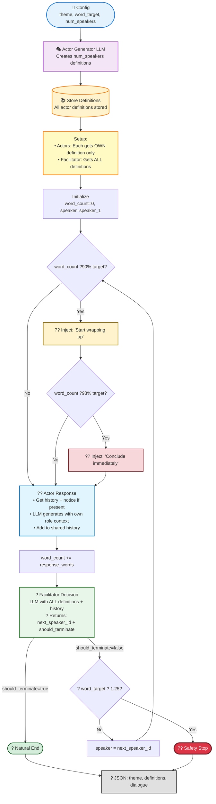

# Summarisation Evaluation

Config-driven eval runner for DialogSum-style conversational summarization.

**Important: Run all commands from project root.**

## Setup

```bash
poetry install --with evals-summarisation
```

## Usage

```bash
# Quick smoke test (2 examples)
poetry run python evals/summarisation/src/evaluate.py

# Full test suite
poetry run python evals/summarisation/src/evaluate.py --config evals/summarisation/configs/test.yaml
```

**Available configs:**
- `smoke-test.yaml` - Fast smoke test with `limit: 2`
- `test.yaml` - Full test suite (no limit)

Outputs are written to `evals/summarisation/output/<run_id>/results.jsonl` and `evals/summarisation/output/<run_id>/summary.json`.

## Running a new experiment

An experiment is defined by:

- A config file in `evals/summarisation/configs/` (dataset, model/judge settings, run parameters like split/limit/prompt_version, and which prompt templates to use).
- Prompt templates in `evals/summarisation/prompts/` (how we ask the model to summarise, and how we ask the judge to score).

All run parameters (`split`, `limit`, `prompt_version`) are now configured in the YAML file under the `run:` section, not as CLI flags.

# Transcription Evaluation

Compares transcription services using the AMI Corpus (auto-downloaded to `input/ami/`).

**Important: Run all commands from project root.**

## Setup

```bash
brew install ffmpeg  # macOS
poetry install --with worker,local-dev,evals-transcription
```

## Usage

```bash
# Run default config (smoketest)
poetry run python evals/transcription/src/evaluate.py

# Run specific config
poetry run python evals/transcription/src/evaluate.py --config larger_cloud_test.yaml
```

**Configs:** `evals/transcription/configs/` (`smoketest.yaml`, `larger_cloud_test.yaml`)

**Results:** `evals/transcription/output/`

# Characteristic Extraction Evaluation

Evaluation framework for extracting characteristics and attributes from transcripts using an LLM. 

## Setup

Ensure you have the required dependencies installed from the project root:

```bash
poetry install --with evals
```

## Usage

1. **Input Data**: Place your transcription files (`.txt` or `.json`) in `evals/characteristics/input/`.
2. **Configuration**: Edit `evals/characteristics/configs/default_config.yaml` to specify the model, dataset settings, and run output paths.
3. **Prompts**: Jinja2 prompt templates are located in `evals/characteristics/prompts/`.

Run the evaluation:

```bash
poetry run python -m evals.characteristics.src.main
```

Results for each input file will be saved to `evals/characteristics/output/` as `<filename>_output.json`.

### Code Structure

- `main.py`: Entry point for the CLI.
- `pipeline.py`: Orchestration of the extraction process.
- `chunker.py`: Logic for transcript chunking and characteristic deduplication.
- `transcript_loader.py`: Formats `.txt` and `.json` transcripts for extraction.
- `sanitizer.py`: WAF-specific sanitization to prevent false-positive security blocks.
- `config_loader.py`: Configuration loading and template rendering.
- `schema.py`: Pydantic models for configuration and extraction results.

# Dataset Generation

Generate synthetic conversational transcripts using LLM-based role-playing.

**Important: Run all commands from project root.**

## Setup

```bash
poetry install --with evals-dataset-generation
```

## Usage

```bash
# Run with default config (smoketest.yaml)
poetry run python evals/dataset_generation/transcription_generation/main.py

# Run with specific config
poetry run python evals/dataset_generation/transcription_generation/main.py --config multispeaker.yaml
```

## Configuration

Configs in `evals/dataset_generation/transcription_generation/configs/`: `smoketest.yaml`, `multispeaker.yaml`

Modify existing configs or create new ones as needed.

### Parameters

| Parameter | Type | Default | Description |
|-----------|------|---------|-------------|
| `theme` | string | *required* | Conversation scenario/topic (e.g., "Team meeting about project priorities") |
| `word_target` | integer | 400 | Target word count for the generated transcript |
| `num_speakers` | integer | 2 | Number of speakers in the conversation |
| `termination_threshold_multiplier` | float | 1.25 | Safety multiplier for `word_target` to prevent runaway generation costs/time. If conversation exceeds `word_target * termination_threshold_multiplier`, generation stops. Most conversations end naturally via notice messages before reaching this limit. |

### Conversation Flow



**Key points:** Actor definitions stored centrally. Each actor sees only its own definition; facilitator sees all. Facilitator makes single decision: `(next_speaker_id, should_terminate)`. Actor responses use actor-centric history view.

### Output

Generated transcripts are saved to: `evals/dataset_generation/transcription_generation/output/transcript_<timestamp>.json`


# Audio Generation

## Eleven Labs

This module generates speech audio from transcript files using ElevenLabs.
The CLI supports separate operations for speech generation and audio transformation.

### Setup
#### Environment variables

Set your ElevenLabs API key in your root .env file:

```bash
ELEVEN_LABS_API_KEY=your_api_key
```

### Input data

 Place transcript files in:

```evals/audio_generation/input/transcripts/```

Each transcript should follow the expected format (see Data Contract). Example input within the configs directory.

### Configuration
#### Models
Specify a model in the config:

- eleven_flash_v2_5 (default)
- eleven_turbo_v2_5
- eleven_multilingual_v2
- eleven_v3

### Voices
The system uses predefined public voices by default.

Custom voices can be configured by adding their IDs to the voices section in the config.

### Usage

This tool uses a hybrid design:

- Core generation is config-driven (TTS pipeline)
- CLI is used only to toggle execution modes

All inputs (transcripts, models, voices, background SFX) are configured via the config file.

#### Generate TTS audio (default)

With configs set, run the pipeline:

```bash
poetry run python evals/audio_generation/src/main.py

```
This will:

- Load transcript from config
- Generate speech audio using ElevenLabs
- Save output to evals/audio_generation/output/


### Output

Generated audio files are saved to:

```evals/audio_generation/output/```


### Audio Transformation

#### Generate TTS with background audio

### Usage
To generate speech and apply background sound effects:

```bash
poetry run python evals/audio_generation/src/main.py with-background-sfx
  ```

This will:

- Generate speech audio from the configured transcript
- Load background sound effect from config
- Mix both audio tracks

#### Inputs:

- audio: file in output/ generated during tts operation
- background: file in input/


#### Output

A new mixed audio file is saved to:

```evals/audio_generation/output/```

File format:

``{speech_name}_mixed_{sfx_name}_{timestamp}.mp3```


#### Notes
- Background audio is automatically looped or trimmed to match speech length
- Volume is adjusted using a predefined offset (config variable ```background_volume_offset```)
- File names are normalized using the base name (prefix before _)